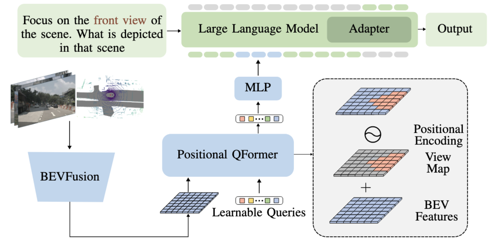

  <strong style="font-size: 24px;">BEV-LLM: Leveraging Multimodal BEV Maps for Scene Captioning in Autonomous Driving</strong>

  

  © 2025 IEEE. Personal use of this material is permitted.  
  Permission from IEEE must be obtained for all other uses, in any current or future media, including reprinting/republishing this material for advertising or promotional purposes, creating new collective works, for resale or redistribution to servers or lists, or reuse of any copyrighte

---